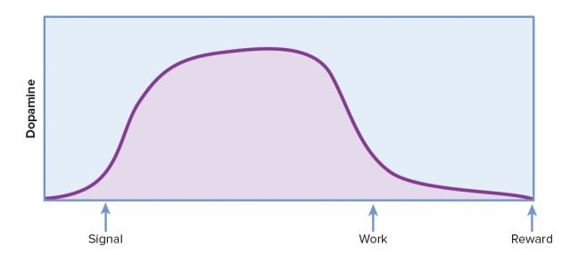

# 盲兽多巴胺

## 一、多巴胺Dopamine是啥？

当我们拿起手机，会不自觉地打开微信。看到小红点，就顺手点开，刷完所有信息。

当我们坐到电脑前，会想到游戏中自己可以操作得更好，可以带动全场，于是打开游戏。

……

当你处于特定环境，或者接受某一信号时，多巴胺就会自动释放，给你对快感的预期。

但是，多巴胺并不是快感，而是对快感的预期，它是一种饥饿感。

&emsp;&emsp;*多巴胺浓度曲线*

多巴胺在接收信号后释放，在行动后消减。

多巴胺是数百万年进化的结晶，它虽然不能给你快乐，但它让你去追求快乐。（这很重要，是对抗抑郁的重要物质。）

它是人内心中一头精力旺盛的野兽，一头Blind Beast【注：盲兽，英文更能表达这股盲目的巨大能量，下同】。

## 二、大脑的选择性遗忘。

在进化的过程中，人类还收获了一套大脑保护系统。

这套保护系统可以将痛苦的记忆封存起来，尽快遗忘掉，防止其损伤脑细胞。

因此，在做一件事情时，我们的大脑本能地记下快乐的部分，过滤掉痛苦的部分。

比如，游戏中，大量无聊的发育，对友挂机，被对友坑，因分歧和队友吵架，被对手打爆，被对手翻盘……这些痛苦的经历全部被大脑遗忘，大脑只存储了游戏中的峰值快感。

当多巴胺预期快感时，它不是按均值预期的，而是按峰值预期的。这就是多巴胺成为Blind Beast的原因。

多巴胺并不保证你获得的快感会大于痛苦，它只保证你有一定概率获得极致的快感。

## 三、自律不等于自戕。

人的身体是诚实的，追求快乐是身体的天性。如果持续地压抑身体的需求，只会适得其反。宗教式的苦修无异于自戕。

人自律的核心，不是“攻克己身，叫身服我”【注：基督教语录，指约束身体，服从灵魂】。

而是，约束Blind Beast，追求均值快乐，而不是峰值快乐。

这两者的区别在于，后者更符合科学，更有可持续性。【注：宗教式的自律，违背了DNA的规律，不具有可持续性，需要虚构上帝给自己能量和监督。】

## 四、如何约束多巴胺系统。

多巴胺并不是直接对应快乐，约束它并不会带来身体的不适。这是科学自律的底气所在。

1. 减少诱惑源。比如工作的时候将手机放到够不着、看不到的地方。

2. 减少高刺激活动，避免多巴胺系统的误判。原理见
@edmond
 的文章。生活中有哪些坏习惯一旦改正就能带来立竿见影的好处？ - 知乎

3. 每次多巴胺工作的时候，提醒自己这只是多巴胺而己，不是真正的快乐，三思而行。

## 五、这一方法的优势

如果用天使代表理性的自己，用魔鬼代表本能的自己。

传统的方法会让天使与魔鬼对立起来，力求让天使战胜魔鬼，但这一目标永远也无法达到，反而让自己变得精神分裂。

这一方法，让天使与魔鬼不再对立起来，两者握手言和，肯定彼此的地位，尊重两方的声音，有商有量地让彼此都能快乐。