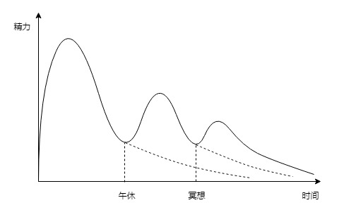

# 如何克服两类拖延症？

拖延分为两类，一类是因为逃避困难而拖延；一类是因为即时满足而拖延。

第一类是因为事情本身需求的意志力较高，自己没有足够的意志力应对，因而逃避。第二类是因为在正事之前，有更快乐的事情，不断消耗自己的意志力，自己无暇他顾。

对两者不加区分或者混为一淡，都不利于克服拖延症。

以行者为比喻，第一类就是面前的高山，第二类如比鞋里的石子。阻止你前行的，常常不是面前的高山，而是鞋里的石子。因此我们先来谈谈第二类拖延，再谈第一类拖延。

## 即时满足

即时满足（Instant Gratification）是人的本能。人为了当下的满足作出最迅速的反应，这在漫长的进化史中，是人类的始祖们必不可少的求生技能。他们在复杂多变的丛林中稍有犹豫，可能就见不到明天的太阳。

人类进入信息化社会之后，铺天盖地的广告、营销、资讯、视频，不断地刺激着人的兴奋点，如果人类仍然屈从于即时满足，必然晕头转向，一事无成。悲守穷庐，将复何及。

即时满足是脑海中稳定的回路，它的电阻小，很容易激活，一旦激活之后，就在大脑中行成短路，将理性思考旁路掉。人看到朋友圈的小红点、知乎的通知，就一定马上要去点，一旦开始就投入不少时间。

那么如何克服即时满足呢？

先了解一个至关重要的概念——损失厌恶（Loss aversion）。顾名思义，大脑像个很贪的小孩，一直在说“ 我全都要。”

大脑对损失更加敏感，不能忍受，它会本能地优先处理那些“可能快速逝去”事情，然后再做十拿九稳的事情。这就是为什么有时候人们在做正事之前，总是先做很多细枝末节的事情。大脑太贪了。

处理这一现象的绝佳方法之一，“五分钟冷静法”（Five-minutes cool-down），把冲动先搁置五分钟，五分钟的冷静时间足以过滤掉大多数无益的冲动。为了配合这一方法，可以把冲动都记录下来，大脑就不会焦虑了。将冲动从大脑内存转到硬盘，可以节省大脑资源，来处理其他事情。

总结一下其他重要方法：

- 慎始。上文提到，即时满足一旦激活，就会稳定的导通回路，会旁路掉理性，很难处理。防患于未燃始终是最经济安全省事的策略，而且会大大地节省大脑的内存。

- 分辨。人的需要分为生理需要和普通欲望。生理需要是需要尽量满足的，而欲望并不需要。分辨这点，有助于给大脑降低焦虑和恐慌。

- 五分钟冷静法。见上文。

## 逃避困难

能逃避的困难，当然要逃避。不可能明知是坑，还跳进去给自己制造困难来克服。

那些一辈子只遇到一两次，没有多少价值的困难能逃避最好逃避。
那些不可逃避的，影响未来的困难，则尽量不选择逃避。

蔡康永说，“15岁觉得游泳难，放弃游泳，到18岁遇到一个你喜欢的人约你去游泳，你只好说“我不会耶”。
18岁觉得英文难，放弃英文，28岁出现一个很棒但要会英文的工作，你只好说“我不会耶””

人逃避的困难越多，力量越弱，路越窄。

如何克服逃避困难呢？

一、 最要紧地是做好精力管理。

人每天的精力不是均等分布的，而是波浪型分布。如图，起床清醒后，精力会迅速攀升，在上午达到高峰，然后随时间幂指式递减。

午休和冥想都会清理大脑进程，清空缓存，和睡眠一样，会恢复大脑一定精力，提升一天的精力总值。

而精力管理的目标并不是单单提升精力，而是充分利用精力和时间做最有价值的事情。

&emsp;&emsp;*宽度代表时间；高度代表精力*

如上图所示，精力管理的目标是：在精力曲线与时间围成的区间内，填充总价值量最多的任务块。

其中：

* 任务一：开拓创新型任务。精力消耗量大（高度很高），持续时间有限，价值很高。
* 任务二：维护型任务。精力消耗量低（高度低），持续时间长，价值一般。
* 任务三：一般事情。精力消耗量低（高度底），持续时间短，价值较低。
* 干扰项：趣事。即粉色区块，需单独说明。 
趣事有很强的趣味性，也会提供一定的价值，就像看视频、微博、微信、知乎一样，提供大量的趣味 和 零散的信息和知识。它们刚开始时消耗精力极少，用户粘性强，持续时间长，后期消耗精力大。

为什么趣事的持续时间长？

一方面快感也会消耗精力的，另一方面由于价值供应不足，人就会因为价值的缺失而产生焦虑，消耗精力。最后，人为了填充价值的缺失，就会增加趣事的摄入量，导致消耗更多时间。

根据精力曲线的形状和任务的特点，人最佳的方案是：在上午时完成任务一，中午是完成任务二，晚上完成任务三。

我的日常计划是：

上午：完成最重要、最有挑战性的开拓型任务。

下午：完成持续性、维护性、一般性任务。

晚上：完成机械型、重复型任务，或单纯信息摄入型任务，比如听听讲座，看学习视频等。

同时，根据干扰项的特点，人要尽量推迟插入干扰项的时间，因为它们持续时间长，消耗大量精力，导致其余任务很难完成。

另外根据边际效用递减法则，娱乐会在刚开始时产生大量快感，后期也会变得枯燥。人沉迷其中，主要是因为惯性。

因此最具性价比的休闲方式是推迟娱乐的开始时间，控制娱乐的结束时间。设定边界是极好的方法。

我一般允许自己在晚上开始娱乐，不超过一个半小时。

二，在着手处理困难时，我总结了一个最有性价比的解决方案。

- 第一步，把难事先开个头。
爬山是艰难的，但是在山脚下蹬两步一点也不难。

另一方面，把难事开个头，能大幅降低自己的焦虑，性价比超高。

- 第二步，开始休息或者冥想。
休息或者冥想都是为了给大脑充能。

另外，在第一步中我们已经在大脑种下了问题的种子，让这颗种子发酵一会，大脑会调动相应的功能和信息为我们服务的。性价比爆表。

- 第三步，开始冲刺。
大脑储能完毕，也腾出了足够的脑容量，可以开始挑战难题了。
在挑战的过程中，给自己立一个志向, 不处理掉某个阶段难题，绝不娱乐，睡觉也不娱乐。因为娱乐对冲刺难题是最有害的。

三、赋予意义

我记得在读初中的时候，每天上下学需要走20分钟左右的路程。
在一个风雪交加的冬天，我在上学的路上感觉寸步难行。

此时心里冒出一个想法，“如果这（眼前的困难）就是我上一流高中的阻碍，我TM的现在就碾碎它。”

靠着这股子不服输的劲，我克服了不少困难，最后上了一个还不错的高中和985大学。

当困难挡在前进的道路上，就把它和自己的整个目标相比较，用达成整个目标的份量（成就感）碾碎当前的困难。这是一个临时提升意志力的好方法。

这个方法背后蕴含着一个科学原理。

把每一个困难或者诱惑都赋予直接影响成败的意义，就能唤起更多的力量来占胜它。

把细节的意义放大，提高人对细节的重视程度，这是古以有之的方法。
> 图难于其易，为大于其细。天下难事必作于易，天下大事必作于细。是以圣人终不为大，故能成其大。——《道德经》

