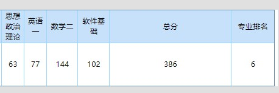

# 2017考研总结

2017考研初试成绩终于出来了，一年的努力终于开花结果。

趁着这股热乎劲，总结下学习方法，希望对大家有些帮助。

## 背景。

2012年，我放弃本校的保研机会，进入国企工作。

2015年，9月份决定跨专业考研，之后忙于工作，年底祼考一次，成绩是212分。

2016年，5月份开始用心准备考研，结果是专业排名第6（某普通985高校，实考人数约200）。

## 困难。

1. 在职备考。

2. 跨专业考研。

3. 游戏上瘾。

## 学习方法

【黄金法则：学习效果=学习时间 * 时间利用率】。

任何学习方法，无非是从“增加学习时间”，“提高时间利用率”两方面入手的。

好些学生聪明反被聪明误，一心想着“提高时间利用率”，却压根没有投入多少时间。

殊不知，巧妇难为无米之炊。

一切的学习方法的实际应用，都是建立在对知识点的理解之上的，这就需要花很多时间。

如果连这点基础的时间都没有，其它的就别谈了，神仙也救不了你。

### 增加学习时间。

1. 白天无娱乐。考研下半年能坚持做到这点，学习时间就完全足够了。我自己也没有坚持做到，但最后两个月算做到了（除了工作之外的休息时间），就已经取得了满意的成绩。

2. 别拿最好的时间背单词。有的同学拿一天中最精神的时间背1.5小时的单词。背完整个人都木了，还能干啥？意志力都耗在单词上，更坚难的任务就别想完成了。

3. 处理你的时间黑洞。如果不能增加学习时间，就减少浪费时间。比如，我在将游戏鼠标和键盘送人之后，游戏的时间大幅减少。

### 提高时间利用率。

1. 好的老师让你事半功倍。通过老师的视频教学，能帮助度过学习起步时的困难期，好的老师能把知识翻译为你熟悉的语言，就更容易理解和吸收。

2. 时间用在刀刃上。好多同学喜欢重复学习自己已经会的知识，完全浪费时间。学习时必须整理自己的错题本，多花时间在自己不会的、没掌握的知识上。

3. 时间用在高回报率的东西上。数学公式是高数的基础，这个公式就是组成机械的零件。把这些反复使用的零件背熟，就能充分享用它的高回报。为什么我的高数144？无他，唯手熟尔。

4. 时间用在归纳整理上。归纳、整理就是从众多知识中提炼精华的知识，是从众多规律中抽象出一般规律。掌握这些知识和规律才可能形成高效的知识架构。 举一纲而万目张，解一卷而众篇明。

【黄金法则】就是从众多学习方法中，抽象出来的终极学习理论。

以此框架为筋骨，其他方法为血肉，你完全有机会成为别人眼中的学霸，甚至学神。

## 后话

17年3月22号复试结果公布，综合排名第5。

17年6月12号收到录取通知书。

在准备复试的过程中，必须坚定地克服各种侥幸心理。

举一个例子，我利用出发当天候车的空余时间，在候车厅模拟英文自我介绍（出声朗诵），既熟悉了稿件，把握了节奏，还增强了信心。

复试当天，虽然有所紧张，但仍然发挥出色。（复试面试第3名）

